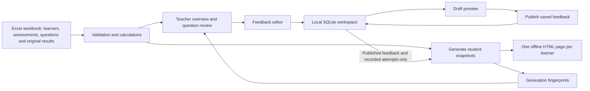

# Studentdash: system guide and route to classroom use

**Ready to use the system? Start with [Your next steps: real data and HTML design](START_HERE.md).**
It walks through setup, your first real class and test, marks, feedback, choosing a
dashboard design, generating files, backups and sharing.

For the current teacher workflow, start with **[Enter your first assessment](FIRST_ASSESSMENT.md)**.
It covers persistent classes, question editing, classifications, Excel-block paste,
save/reopen, overview and individual dashboards without workbook preparation.

You can now choose **Import assessment** to upload PDF/DOCX tests, review extracted
questions and automatic classification suggestions, then create a normal assessment.
See the short [assessment import guide](ASSESSMENT_IMPORT.md), including its current
extraction limits and the distinction between local inference and an external AI model.

## Architecture direction

Studentdash is subject-independent and curriculum-independent. IB Chemistry is the
first implementation and test profile. Existing SL/HL, syllabus and classification
behavior described below reflects the current implementation, not the generic domain
model. See [Architecture direction](ARCHITECTURE.md) for the assumption inventory,
configuration boundary and gradual migration plan. Prioritize usable local IB
Chemistry assessments; preserve compatibility and refactor only for current features.
Do not begin building the public/hosted version.

For a one-page introduction to share with a colleague, read
[Studentdash for teachers](TEACHER_OVERVIEW.md). Compare ten working student
dashboard designs in the [layout gallery](../examples/layouts/index.html).

## 1. What the system does

Studentdash turns assessment records into individual learning dashboards. The teacher
enters assessments in the local class screens (or maintains an existing Excel
workbook), reviews class and question performance, writes
feedback, and generates a separate HTML snapshot for each learner. Students can read
their snapshot offline, inspect the questions behind a percentage, review teacher
feedback, and work through revision tasks.

Development uses fictional records only. The default demonstration is a class of
24 fictional learners across six assessments from April to September 2026. It has
four SL/HL class groups, 36 questions, 665 question-result rows, 34 retry records,
resources and exit tickets. Some records are intentionally incomplete so that the
teacher interface demonstrates missing, pending, absent, exempt and unrecorded work.

This is a local assessment-feedback tool. It now includes an interactive exit-ticket
simulation: paste one JSON block, publish to fictional students, collect responses,
mark supported answer types deterministically and review written answers. It does
not administer formal online tests, send files to students, connect to a school
information system or provide real student accounts. Suggested assessment grades
are not an official gradebook or a final-grade calculation.

See [Local exit tickets](EXIT_TICKETS.md) for the exact JSON schema, reusable ChatGPT
prompt, teacher/student workflow, storage model and a short manual test procedure.

## 2. How the parts fit together



There are three different kinds of storage:

The table below describes the existing workbook workflow. Teacher-entered classes
instead use one `.sdclass` source file per class under `data/entered_classes/` by
default, with a paired `.workspace.sqlite3` file for feedback/retries. Their generated
pages are separated by class under the output folder. Preserve each source and its
paired workspace together. The UI handles their identities and locations. If a custom
workbook location is configured, `entered_classes` lives beside that workbook.

| Location | Purpose | What to preserve |
|---|---|---|
| Excel workbook | Learners, assessment definitions, original marks, classifications, resources, imported exit tickets and imported attempts | The authoritative source of original assessment data |
| Adjacent `.workspace.sqlite3` file | Teacher drafts, published comments/tasks, attempts, local exit-ticket definitions/assignments/submissions/marks | Preserve together with its workbook; these edits are not written back to Excel |
| Output folder | Generated HTML snapshots and `generation.json` | Regenerable from the current inputs; archive separately if historical copies matter |

Student checklist ticks are a fourth, deliberately limited kind of state: they live
in the student's browser, when browser storage is available. They are not saved in
Excel or SQLite and the teacher cannot see them.

For the default workbook, the local workspace file is
`data/classroom.workspace.sqlite3`. It is created when the teacher saves edits or
opens the interactive exit-ticket workspace. The original Excel workbook is never
edited by the application.

## 3. Starting the fictional demo

From the project folder in PowerShell:

```powershell
python -m venv .venv
.\.venv\Scripts\python -m pip install -r requirements.txt
.\.venv\Scripts\python create_example_workbook.py
.\.venv\Scripts\python seed_exit_tickets.py
.\.venv\Scripts\python generate.py --no-examples
.\.venv\Scripts\python teacher.py
```

If the environment and classroom workbook already exist, skip their creation and
start with generation or the teacher command. The example generator refuses to
overwrite an existing workbook. That refusal is expected, not an instruction to
delete the existing file.

Open `http://127.0.0.1:5000` on the same computer. Generated classroom snapshots use
filenames `student2001.html` through `student2024.html` in `output/`. Open a snapshot
directly in a browser to try the offline student experience. The old small demo uses
IDs 1001 and 1002; those are a different dataset.

To create a new copy of the classroom fixture:

```powershell
.\.venv\Scripts\python create_example_workbook.py --output data/classroom-copy.xlsx
```

To create the smaller two-learner fixture, add `--small`. The default small-file name
is `data/fictional.xlsx`; select it explicitly if you want the application to use it.

Configuration is controlled by environment variables:

```powershell
$env:STUDENTDASH_WORKBOOK = 'C:\SchoolData\CourseDemo\classroom.xlsx'
$env:STUDENTDASH_OUTPUT = 'C:\SchoolData\CourseDemo\snapshots'
.\.venv\Scripts\python teacher.py
```

These variables apply to commands started from that terminal. Restart the server
after changing them. Relative paths resolve from the project folder. Use a dedicated
output directory: generation removes obsolete `student*.html` files from that folder.

## 4. The workbook model

The complete header list is in the README. Headers belong in row 1. The importer
reads the supported sheets and columns; Excel table names and visual matrix positions
are not used as relationships.

| Sheet | What it represents |
|---|---|
| Students | Stable StudentID, teacher-visible name, email field and class label |
| Assessments | Stable AssessmentID, title, date, subject and full-question-set marks |
| Questions | Stable QuestionID, its assessment, number, SL/HL applicability, text, marks, topic, subtopic and command term |
| Results | One assessment summary per learner: earned marks, possible marks and status |
| Grade boundaries | The default inclusive percentage thresholds for grades 1 through 7 |
| Memberships | Explicit learner-to-assessment assignment and SL or HL level |
| QuestionResults | One learner's score/status on one question in one assessment |
| AssessmentBoundaries | Optional assessment-specific thresholds replacing the global set |
| Resources | Teacher-written topic resources embedded as text in the snapshots |
| ExitTickets | Previously recorded student reflections and teacher responses |
| RevisionAttempts | Optional imported retry history against an original graded question |

The first five sheets are required. The extensions can be absent for a legacy
workbook, but meaningful question analytics need both Memberships and QuestionResults.
Linked questions need text, marks and classifications. `MCQ` is a question type, not
a command term. The system checks this particular mistake but does not validate the
entire syllabus or every possible command term against an official vocabulary.

IDs must contain only letters, digits, underscores or hyphens. Question IDs are
globally unique across the workbook. Student IDs must also be unique without regard
to case, because they become filenames on Windows. Keep IDs stable when editing
names or moving learners between classes.

Membership is explicit. HL learners can receive SL and HL questions; SL learners
cannot receive HL-only questions. `BOTH` applies to either level. Class names are
filter labels, not a substitute for membership. Reusing IDs for another cohort in
the same workbook/workspace pair risks associating old feedback with new people;
start a separate pair for a new course or cohort.

## 5. What the percentages and grades mean

Assessment summaries and question evidence are separate sources. This is intentional:
incomplete question marking must not silently rewrite an assessment grade.

That rule applies to imported workbook summaries. For assessments created in the
new class screens, question marks are authoritative: totals are derived on every
read. Incomplete rows have no final total or grade; an old complete total cannot
survive a correction. No grade boundaries are assumed for newly entered assessments.

For assessment history, only graded Results count. The overall percentage is total
earned marks divided by total possible marks across those graded summaries. For
example, 8/10 followed by 12/30 gives 20/40 = 50%, not the simple average of 80% and
40%. No additional term weights or final-grade policy are implemented.

For topic, subtopic and command-term categories, only graded question results count:

| Status | Score requirement | Effect on category percentages |
|---|---|---|
| graded | Numeric, including zero | Earned and possible marks both count |
| missing | Blank | Excluded; shown as missing |
| pending | Blank | Excluded; shown as pending |
| absent | Blank | Excluded; shown as absent |
| exempt | Blank | Excluded; shown as exempt |
| No record | No row exists | Not inferred to be missing or zero |

A 100% topic result based on one marked question does not imply mastery of every
question in that topic. Read the evidence count and inspect the question records.
The teacher overview shows how many applicable learners have a graded response.

Strength/work-on hints require at least two graded questions in a command term.
At least 75% produces a strength hint; below 50% produces a work-on hint. These are
prototype thresholds for discussion, not validated diagnoses or an official IB rule.

Suggested grades use inclusive minimum thresholds. Every boundary set contains
grades 1 through 7, with grade 1 starting at 0%. An assessment-specific set overrides
the global set only for that assessment. The default demo boundaries are fictional
configuration, not a claim about current examination boundaries.

The importer reconciles question totals with a Results summary only when every
applicable question has a graded or exempt record. Exempt questions contribute no
marks and no denominator. Disagreements produce teacher notes. The application
retains Results rather than guessing which source is correct. Incomplete evidence
also produces a note; that can be expected for work still being marked.

Excel formulas must be recalculated and saved in Excel before import. openpyxl reads
saved formula values and does not recalculate them. A changed-file fingerprint can
detect that a workbook changed; it cannot prove that Excel's cached values are fresh.

## 6. The teacher's daily workflow

1. Record the assessment and question marks in the workbook and save it.
2. Open the teacher workspace. Fix validation errors and review quality notes.
3. Filter the class overview by class and/or assessment. Inspect status counts and
   the questions with lower graded percentages. Check evidence size before deciding
   to reteach something.
4. Open **Feedback & revisions** beside a learner. Select the relevant assessment.
5. Write a comment and one assigned revision task per line. Save the draft.
6. Open **Preview saved draft and publish**. Review the student-facing content.
7. Publish that saved draft. Publication makes it eligible for export; it does not
   update old HTML files or send anything to the learner.
8. Return to the main workspace and generate dashboards. Open representative pages
   and inspect their feedback, marks, task lists and attempt history.
9. Distribute only the appropriate individual snapshot through an approved channel.

Draft preview uses the same student renderer as generation. It temporarily substitutes
the selected saved draft for that learner and assessment; it does not save a student
snapshot. Other assessments still use their published feedback. The preview is clearly
marked teacher-only and includes the publish control.

Once feedback has been published, subsequent draft edits leave the last publication
intact until you publish again. Publishing an empty saved draft removes the previous
comment and tasks from future snapshots. Already-distributed files are not recalled.

The editor uses a version check. If another tab changes the feedback after you opened
it, a stale save or publish is rejected rather than silently overwriting the newer
version. It is still a local single-teacher workflow, without shared-user accounts,
editor attribution or a full publication audit trail.

### Local interactive exit-ticket workflow

Open **Exit Tickets** from the teacher workspace. Paste one JSON block into **Create
exit ticket**, import it, inspect the student-form preview and exact assignments,
then publish. The seeded fictional example covers all six supported question types.
Use **Act as a fictional student** to switch this browser session to that learner.
Students see available/completed tickets, submit once, and see their own result history.
Return to teacher simulation to review written answers and award partial marks.

Drafts are hidden. Unpublishing prevents new submissions and retains stored answers.
Definitions and assignments freeze once submissions exist. Automatic marking uses
only explicit rules and keys; written explanations need teacher review. Correct
answers are hidden by default, and released after submission only when that policy
was explicitly enabled on the ticket. See `EXIT_TICKETS.md` for the full contract.

Interactive exit tickets now support [audited corrections, linked retakes and
answer-release policies](FOLLOW_UP.md). These controls preserve original answers;
retake results stay separate from original topic aggregates. The milestone
[TODO](../TODO.md) lists suggested next work.

## 7. Recording and interpreting revision attempts

The feedback editor also offers **Record a revision attempt**. Choose an originally
graded question, enter the attempt date and new score, and optionally add a note.
The score must be finite and within that question's marks. Interface-recorded attempts
cannot predate the assessment or have a future date.

The workspace saves the original score and maximum alongside the attempt. If a learner
originally earned 1/3, then later earns 2/3 and 3/3, the history can show both retries
against that original 1/3. A lower retry score is also retained; it is not hidden.

Attempts entered through the interface preserve that captured baseline. Imported
RevisionAttempts rows are joined to the workbook's original question result on import.
Do not overwrite original question rows with retry marks if you want to preserve the
original assessment evidence.

Retry scores do not replace Results, affect suggested grades, alter original topic
percentages, or automatically mark a browser checklist item complete. They show
additional practice evidence. A mark increase after retrying a familiar question is
not automatically a measure of independent mastery on a new assessment.

The current interface records attempts but does not have correction/deletion controls
or duplicate-submission detection. Check entries before submitting. Before relying on
this history in a real course, add an audited correction workflow or establish an
approved way to correct mistakes while preserving the history.

## 8. What the student sees

Each snapshot contains only the view built for its learner: anonymous-looking ID,
assessment history, graded-question categories, their own question records, published
teacher comments/tasks, matching topic resources, their exit tickets, revision plans
and their revision-attempt history.

The whole class roster, structured name/email fields, question answer keys, teacher
quality warnings and other learners' records are excluded. An ID is a pseudonym, not
proof of anonymity. Teacher free-text fields can still contain names or sensitive
details if entered there; content must be reviewed before distribution.

The assessment selector changes the visible totals, feedback, questions, resources,
exit tickets and attempts together. Filtering is local and works offline. Without
JavaScript the all-assessments view remains readable.

The automatic revision plan selects up to three graded questions with the most lost
marks in the chosen view. It links matching topic resources. Teacher-assigned tasks
are separately shown under teacher feedback so learners can distinguish deliberate
teacher advice from automatic suggestions.

Checklist ticks are stored only in that browser when supported. They synchronize
between the all-assessments view and the corresponding assessment view. A changed
question text or score starts a fresh automatic checklist item. Moving files, changing
browsers or clearing browser storage may lose ticks. No submission is made to the
teacher. The print button prints the currently visible assessment view; check the
browser's print preview before distributing a PDF.

The interactive local student dashboard is an additional view. It shows live ticket
availability, submission history and fully marked exit-ticket evidence separately from
formal assessment evidence. Matching uses exact topic/subtopic labels. The sources
are never combined into a mastery percentage. Offline snapshots retain imported
Excel reflections but do not contain interactive ticket submissions or fake submit
buttons. Local exit-ticket marking updates the interactive view without regeneration.

The student identity is stored in a session only after an explicit teacher simulation
action. Changing a StudentID in the URL cannot switch that identity. Teacher routes
are blocked in student mode until the user deliberately returns to teacher simulation.
Anyone with local access can make that switch, so this is not authentication and must
not be used as production access control. Tabs share their simulated identity.

## 9. Snapshot freshness and regeneration

The teacher overview is calculated from current sources. Student snapshots are fixed
copies from a previous generation. Editing a workbook or publishing feedback does
not make already-open or distributed snapshots live.

Generation records fingerprints of four inputs:

- Workbook contents, including imported attempts and exit tickets.
- Published feedback and tasks. Saved drafts are deliberately excluded.
- Attempts entered through the local teacher interface.
- Student templates and the source code used to read/calculate/render them.

The generation manifest also records individual HTML file fingerprints. The teacher
workspace lists reasons for stale content and filenames that are missing, modified
or need refresh. Source changes conservatively mark all current learner snapshots
for regeneration; the system does not yet calculate a minimal per-learner update.

All pages are validated and rendered before replacement begins. Generation rejects
inputs that change during rendering. Output replacement is per file, not a single
transaction for the entire directory: a later I/O failure can leave a partially
updated output set. Fix the underlying issue and regenerate before distribution.
This is one reason to review the freshness state after generation.

## 10. What is needed to use actual students and assessments

There are two substantially different routes. The simplest pilot keeps Studentdash
on the teacher's computer and distributes individual snapshots through an existing
school-approved system. A shared online student portal requires further engineering.
No real records need to be added to this development workspace for either route.

### Route A: a supervised local pilot

Before a small pilot, complete the following with the school:

1. **Agree the purpose and marking policy.** Decide what students should infer from
   percentages, which grade boundaries apply, how exemptions change denominators,
   and whether missing work is excluded or handled differently. The implemented
   policy must match the intended teaching policy.
2. **Confirm permitted storage and distribution.** Have the appropriate school data
   owner/IT staff approve the device, folders, backup location, retention period and
   channel for sending individual files. This is an operational approval step, not
   a claim that the prototype satisfies a particular legal standard.
3. **Prepare a separate course workbook and workspace location.** Use stable IDs,
   correct question classifications and explicit assessment membership. Do this on
   the approved school device, outside this fictional development environment.
4. **Rehearse one assessment end to end using fictional data.** Enter marks, fix
   validation problems, write and publish feedback, record a retry, regenerate,
   distribute a sample page, and verify that it opens on the intended student device.
5. **Verify calculations manually.** Include a graded zero, absent work, an exemption,
   an incomplete question record, SL/HL variants and scores exactly on boundaries.
   Compare both summary and question-category denominators with hand calculations.
6. **Review every file-recipient mapping.** Static filenames are not access control.
   Never give students the teacher preview list, output folder, workbook or SQLite file.
   Verify that the chosen delivery method preserves individual permissions.
7. **Set up backup and restore.** Back up the workbook and its paired SQLite file
   together. Stop editing/the local server during a simple file-copy backup. Test
   restoring a copy and regenerating the expected feedback and attempts.
8. **Complete release verification.** Run the full software suite successfully on
   the target computer and perform browser, offline, print and accessibility checks.
   The implementation verification limits from this development session are recorded
   in `VERIFICATION.md`.
9. **Pilot with a small group and teacher review.** Treat suggested grades as provisional
   feedback until results and workflow have been checked. Keep the existing official
   grade-recording process in place.

For a formal classroom test, use your existing paper or digital assessment delivery
method. Formal assessment dashboards start after questions, membership and marks have
been recorded. The new local exit-ticket forms are a fictional development simulation,
not a production test-taking platform. An import adapter for a marking spreadsheet
or digital assessment platform would still be a separate feature.

### Route B: an online student portal

Deferred reference only: this route is not authorized implementation work or the
next milestone. The current priority is the local assessment workflow.

Do not expose the current Flask development server to the network. A portal would
need, at minimum:

- School-approved sign-in and a reliable identity-to-StudentID mapping.
- Server-side authorization on every student-data request and explicit teacher roles.
  Hiding a link or using unpredictable filenames is insufficient.
- A production deployment with HTTPS, managed secrets, controlled storage permissions,
  backups, updates, monitoring and recoverable error handling.
- Course/year separation, membership lifecycle and a process for students leaving or
  changing classes. Published access must be revocable.
- Audited edits, publication and correction histories, particularly for attempt records.
- Tested concurrent editing and a deliberate database migration/restore strategy.
- A reviewed student submission workflow if exit tickets or retries are to be entered
  online, with validation and clear distinction between submission and teacher grading.
- Testing with school accounts and devices, including unauthorized-access tests.

Microsoft integration could be part of that design, but no such integration is
implemented or required for the local pilot. Select the hosting and identity approach
with school IT rather than treating the current local server as a ready-made portal.

### Remaining product limitations to address deliberately

Warnings do not prevent a teacher from generating pages; publication is not blocked
automatically on unresolved summary disagreements. Attempt correction controls,
formal-feedback publication audit history, course migration tooling and single-click backups are not
implemented. The prototype does not calculate official final grades or assess whether
its simple learning hints are pedagogically valid. These should be addressed according
to the intended pilot scope before expanding use.

## 11. Software checks and troubleshooting

Run the suite from the project folder:

```powershell
.\.venv\Scripts\python -m unittest discover -s tests -v
```

The repository contains CI configuration for Windows and Linux with Python 3.10 and
3.13. A configured workflow is not evidence that the current branch has passed CI;
inspect its actual results after pushing.

| Symptom | What to check |
|---|---|
| Workbook not found | The configured workbook path; create the fictional demo only when that is the intended input |
| Formula has no saved value | Recalculate and save the workbook in Excel |
| Feedback missing from student page | Save draft, publish it, regenerate, then open the newly generated file |
| Old feedback still visible | A new draft does not replace the last publication; publish it or publish an empty draft to clear |
| Stale draft rejection | Another tab saved or published it; recover your text with Back and reload the current version |
| Attempt rejected | Original graded question, numeric range, correct learner/assessment and valid date |
| Snapshot marked stale after code edits | Expected; the student renderer or calculation source changed |
| Checklist did not persist | Browser storage may be unavailable for local files or a different file/browser was opened |
| Permission error | Read access to the workbook, write access to its workspace directory and output directory, and access to temporary directories |

If an error occurs during generation, do not distribute the output until a successful
generation and freshness check. Keep a copy of the workbook and workspace before
making structural changes. Renaming/moving only the workbook does not move its
workspace automatically; move/rename the paired SQLite file accordingly.

## 12. Code map

| File/module | Responsibility |
|---|---|
| `create_example_workbook.py`, `studentdash/demo.py` | Small and classroom fictional fixtures |
| `studentdash/config.py` | Workbook, output and paired workspace locations |
| `studentdash/excel.py` | Required sheet/column validation, cached formulas, core records |
| `studentdash/question_data.py` | Membership, question results, boundary overrides, resources, tickets and imported attempts |
| `studentdash/models.py` | Workbook data records |
| `studentdash/entry.py`, `studentdash/entry_routes.py` | Persistent teacher-entered classes, assessment/question editing, score validation and adapter to existing reporting |
| `profiles/ib_chemistry.json` | Existing classification vocabulary as configuration, copied into each new class |
| `studentdash/analytics.py` | Learner-scoped calculations and student-facing views |
| `studentdash/overview.py` | Teacher-only class and question summaries |
| `studentdash/workspace.py` | SQLite draft/publication state and recorded attempts |
| `studentdash/freshness.py` | Input fingerprints and reasons for stale snapshots |
| `studentdash/render.py` | Build and write student snapshots and their manifest |
| `studentdash/teacher.py` | Local Flask pages, forms, simulated-role boundary, CSRF checks and previews |
| `studentdash/exit_schema.py` | One-block JSON validation and deterministic marking |
| `studentdash/exit_tickets.py` | Exit-ticket use cases and allowlisted student/result views |
| `studentdash/exit_store.py` | SQLite adapter for definitions, assignments, submissions and reviews |
| `studentdash/exit_routes.py` | Teacher ticket workflow and simulated student routes |
| `seed_exit_tickets.py` | Repeatable fictional ticket draft setup |
| `templates/` | Teacher/editor/student interfaces and shared styling |
| `tests/` | Fictional-data validation, calculations, isolation and workflow checks |

The important separation is between workbook data, teacher-only state and student-only
views. Preserve that separation when adding new features: an export should receive
the intended learner's view, never a whole roster or the raw teacher workspace.
